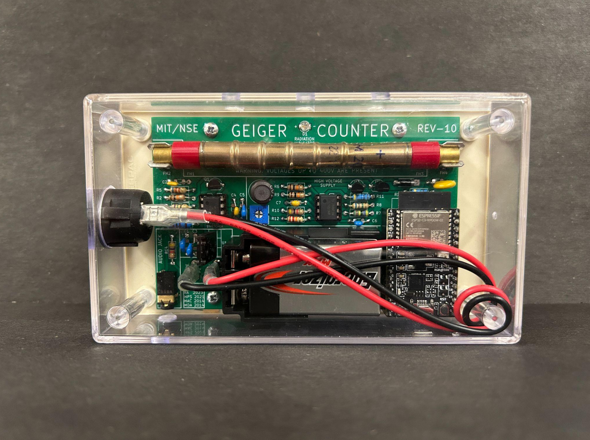

## These files contain all the work Rhett Applestone has done in the summer of 2024 for the MIT-NSE Geiger Project



NOTICE:

REV-10 is the most stable version, REV-11 has not been proven to work and seems to have problems with the mosfets heating up, atleast when run from a bench supply

We use Kicad for PCB design, and Freecad primarily for 3d modeling and engineering drawings. Although now, Ondsel (a Freecad derivitive)
seem much easier to use an more polished and uses the same file format as freecad.(FCStd) 


I choose to switch to Kicad so anyone could build upon the work I did. Kicad Is Free and open source. Fusion-360 Cad and Electronis is "free" for students and maybe hobbyists, but anyone who has dealt with
software knows there's a big difference between a link to download software immedately and like a "fill out this form and make an account, request a trial and yada yada."

Fusion-360 is also heavily cloud based and really doesnt like you to save things to disk. Cloud based in my opinion is garbage, I don't want to be forever locked in to thier ecosystem, I want to save files to my disk.

Fusion-360 is also just pretty bad software in my opinion. Dont get my wrong it's ok, but like, I want my software to be good for life, load fast, and never ask me to sign in or connect to wifi, or say I need to update etc.

Fusion also loads really slow, which is infuriating when you want to make small changes. Kicad loads in less than 1 second on my computer. 

Both Kicad and Freecad (Or Ondsel) do things somewhat differently from other EDA or CAD programs, and I would recomend watching and completing a tutorial on both


### Getting Software set up

For linux (mint)

Run thiese commands in the terminal

### Installing Kicad

```
sudo add-apt-repository ppa:kicad/kicad-8.0-releases
sudo apt update
sudo apt install kicad
```

### Installing Freecad

```
#This line not necessary if you're on ubuntu
sudo rm /etc/apt/preferences.d/nosnap.pref

sudo apt install snapd -y

sudo snap install --edge freecad

snap refresh
```

### Installing Ondsel		

go to their github and download correct release https://github.com/Ondsel-Development/FreeCAD/releases

or

https://ondsel.com/

go to their website and make an account then download, 

appimages have to be made executable and then can be run

### Mac, Windows, other linux

Go to Kicad and Freecad (or Ondsel)'s websites and see download instructions
